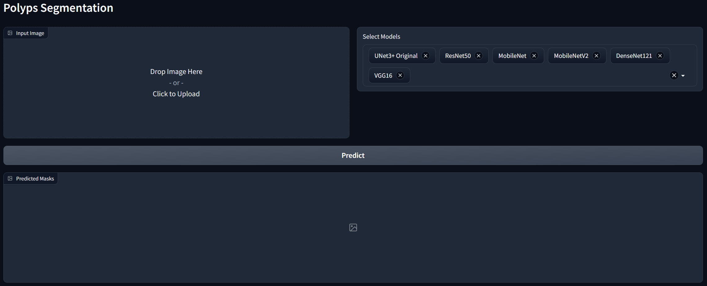
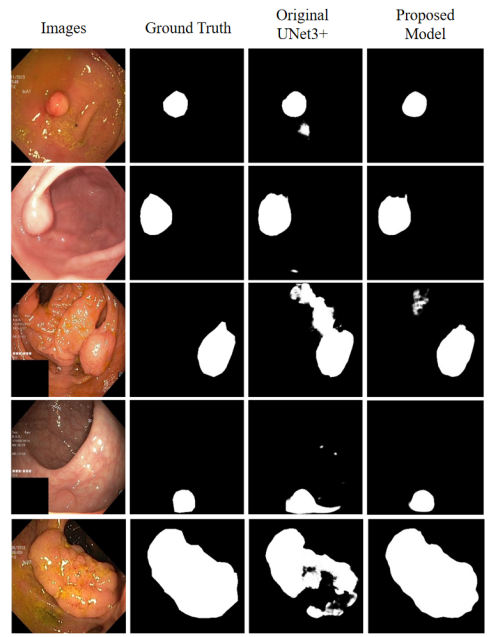
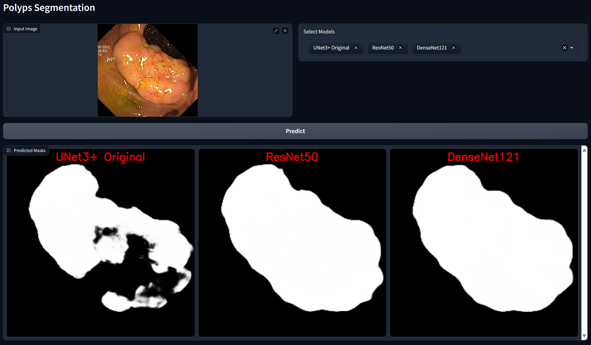
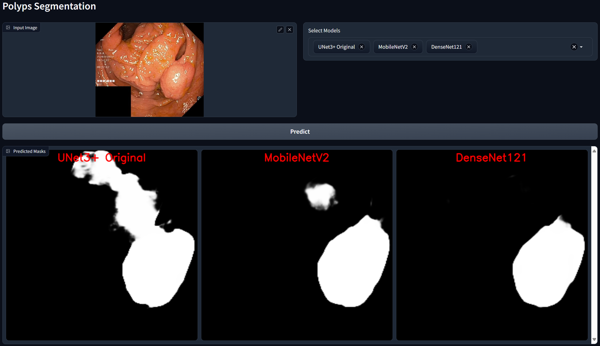
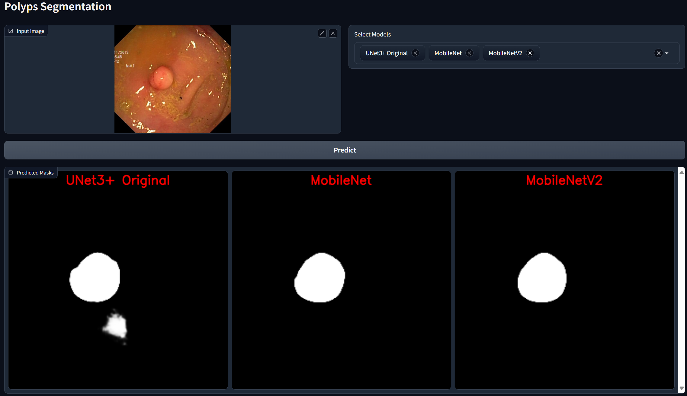

# Polyp Segmentation with Enhanced UNet3+ and Transfer Learning

[](LICENSE)



## Project Overview

This repository provides the official code and demo for the research paper:

> **"Polyp Segmentation Using UNet3+ with Transfer Learning from Pre-trained Backbones"**  
> [Springer Link](https://link.springer.com/chapter/10.1007/978-3-031-88705-5_24)

**Abstract:**
This project addresses polyp segmentation in medical imaging using deep learning. It enhances the UNet3+ model by applying a transfer learning approach, reusing intermediate layers from pre-trained models (such as ResNet50, MobileNet, DenseNet121, VGG16, and MobileNetV2) to build the encoder. This method improves segmentation accuracy and reduces model complexity, as confirmed by experiments on the Kvasir-SEG dataset.

## Key Features
- **Multiple segmentation models:**
  - UNet3+ (Original)
  - UNet3+ with ResNet50, MobileNet, MobileNetV2, DenseNet121, VGG16 backbones
- **Transfer learning:** Encoder built from intermediate layers of pre-trained models
- **Web-based demo:** Gradio interface for interactive segmentation
- **REST API:** FastAPI endpoints for programmatic access
- **Batch inference:** Predict masks from multiple models and download as ZIP
- **Sample images and results included**

## Scientific Contribution
- **Enhanced UNet3+ Architecture:**
  - The encoder path of UNet3+ is replaced with intermediate feature maps from popular pre-trained models (ResNet50, MobileNet, MobileNetV2, DenseNet121, VGG16), leveraging transfer learning for improved feature extraction.
  - This approach reduces the number of trainable parameters and improves generalization, especially on limited medical datasets.
- **Reproducibility:**
  - All training notebooks and model weights are provided for reproducibility and further research.

### Performance Illustration

The following image visually compares the segmentation performance of the proposed UNet3+ model with transfer learning against the original UNet3+ model, alongside the ground truth mask. This illustration highlights the improved accuracy and delineation achieved by the enhanced model.



## Folder Structure
```
.
├── inference.py             # Main app (FastAPI + Gradio)
├── requirements.txt         # Python dependencies
├── model/                   # Trained model weights (.keras)
│   ├── original.keras
│   ├── resnet50.keras
│   ├── mobilenet.keras
│   ├── mobilenetv2.keras
│   ├── densenet121.keras
│   └── vgg16.keras
├── training_notebooks/      # Jupyter notebooks for training each model
│   ├── unet3plus-original.ipynb
│   ├── unet3plus-resnet50.ipynb
│   ├── unet3plus-mobilenet.ipynb
│   ├── unet3plus-mobilenetv2.ipynb
│   ├── unet3plus-densenet121.ipynb
│   └── unet3plus-vgg16.ipynb
├── sample_img/              # Sample images from Kvasir-SEG for inference
├── sample_result/           # Demo screenshots and segmentation results
│   ├── demo_interface.png
│   ├── demo_interface_2.png
│   ├── demo_interface_3.png
│   └── startup_interface.png
└── README.md                # Project documentation
```

## Installation & Setup

### Requirements
- Python 3.8+
- See `requirements.txt` for all dependencies

### Setup Steps
1. **Clone the repository:**
   ```bash
   git clone <your-repo-url>
   cd <your-repo-directory>
   ```
2. **Install dependencies:**
   ```bash
   pip install -r requirements.txt
   ```
3. **Download or train models:**
   - Place the provided `.keras` model files in the `model/` directory.
   - If you wish to retrain, see [Model Training](#model-training).
4. **Run the application:**
   ```bash
   python inference.py
   ```
   - Web interface: [http://localhost:8000/gradio](http://localhost:8000/gradio)
   - API docs: [http://localhost:8000/docs](http://localhost:8000/docs)

## Usage

### Web Interface (Gradio)
1. Open your browser at [http://localhost:8000/gradio](http://localhost:8000/gradio)
2. Upload a colonoscopy image (sample images in `sample_img/`)
3. Select one or more models (all are selected by default)
4. Click **Predict** to view and compare segmentation masks

<div align="center">
  
  <p><em>Segmentation results example 1</em></p>
  
  <p><em>Segmentation results example 2</em></p>
  
  <p><em>Segmentation results example 3</em></p>
</div>

### API Endpoints (FastAPI)
- **Predict with a single model:**
  - `POST /predict`
  - Form data: `file` (image), `model_name` (e.g., `UNet3+ Original`)
  - Returns: JPEG mask
- **Predict with multiple models:**
  - `POST /predict_multi`
  - Form data: `file` (image), `models` (comma-separated model names)
  - Returns: ZIP file of masks

#### Example (using `curl`)
```bash
curl -X POST "http://localhost:8000/predict" \
  -F "file=@sample_img/cju5u6wf0kh1t0755bg1ssixv.jpg" \
  -F "model_name=UNet3+ Original" \
  --output mask.jpg

curl -X POST "http://localhost:8000/predict_multi" \
  -F "file=@sample_img/cju5u6wf0kh1t0755bg1ssixv.jpg" \
  -F "models=UNet3+ Original,ResNet50" \
  --output masks.zip
```

## Model Training

The models are trained on the [Kvasir-SEG](https://datasets.simula.no/kvasir-seg/) dataset.

### Dataset Structure
```
Kvasir-SEG/
  images/
    *.jpg
  masks/
    *.jpg
```

### Training Notebooks
- Each model variant has a dedicated notebook in `training_notebooks/`:
  - `unet3plus-original.ipynb`: Standard UNet3+
  - `unet3plus-resnet50.ipynb`: UNet3+ with ResNet50 encoder
  - `unet3plus-mobilenet.ipynb`: UNet3+ with MobileNet encoder
  - `unet3plus-mobilenetv2.ipynb`: UNet3+ with MobileNetV2 encoder
  - `unet3plus-densenet121.ipynb`: UNet3+ with DenseNet121 encoder
  - `unet3plus-vgg16.ipynb`: UNet3+ with VGG16 encoder

#### Training Steps
1. Set the dataset path in the notebook:
   ```python
   dataset_path = "/path/to/Kvasir-SEG"
   ```
2. Run the notebook to train and export the `.keras` model file
3. Move the trained model to the `model/` directory

## Sample Images & Results
- **`sample_img/`**: Contains sample images from Kvasir-SEG for quick inference
- **`sample_result/`**: Contains demo screenshots and example segmentation outputs

## Dependencies
- TensorFlow
- OpenCV
- FastAPI
- Gradio
- Uvicorn
- See `requirements.txt` for the full list

## Citation
If you use this code or models in your research, please cite the official paper:

```
@inproceedings{your_citation_key,
  title={Polyp Segmentation Using UNet3+ with Transfer Learning from Pre-trained Backbones},
  author={...},
  booktitle={...},
  year={2024},
  publisher={Springer}
}
```

## Acknowledgements
- [Kvasir-SEG Dataset](https://datasets.simula.no/kvasir-seg/)
- [UNet3+](https://arxiv.org/abs/2004.08790) and backbone models


---

**Enjoy segmenting polyps with efficient models and a user-friendly interface!** 